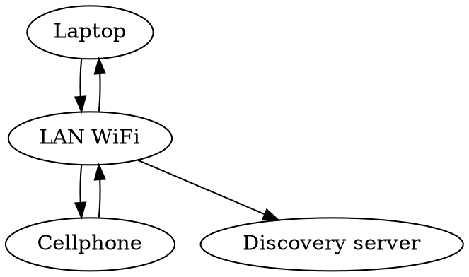

## Syncthing on a LAN

Allowing Syncthing through the firewall enables sync between devices on a Local network (LAN) directly, 
instead of having to make roundtrips to Syncthing's Discovery servers.



### Linux

*Tested on Ubuntu and Raspbian*

Run these in the terminal

```bash
sudo ufw allow syncthing
sudo ufw allow syncthing-gui
```

Verfiy that firewall rules were added

```bash
sudo ufw status verbose
```

## Ignore Node Modules

Put these in the folders `.stignore`:

```
node_modules
**node_modules
```